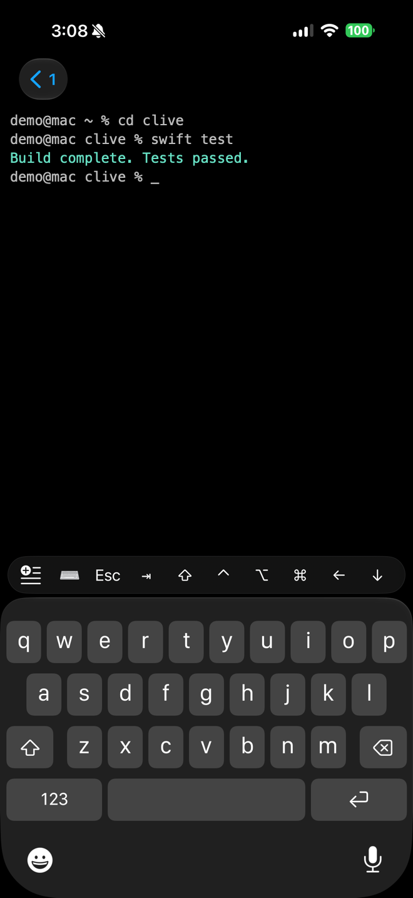
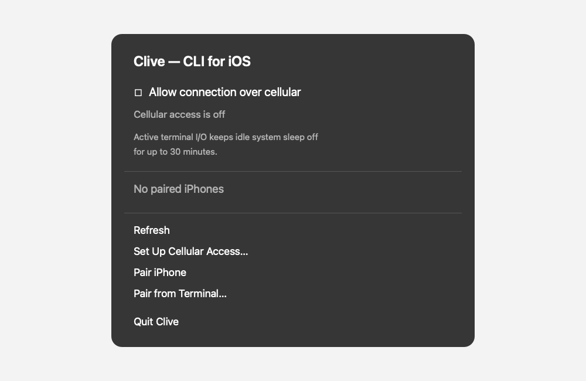

# Clive

[](https://github.com/brendanwilliam/clive/actions/workflows/verify.yml)
[](https://github.com/brendanwilliam/clive/releases)


[](LICENSE)

Securely access your Mac terminal from your iPhone, over your LAN or direct cellular connections.

Clive combines a native SwiftUI terminal client with a user-started macOS menu bar companion and CLI. Pair with a short-lived QR code, approve the Mac's displayed fingerprint, and open independently isolated terminal tabs over mutually authenticated TLS.

> [!WARNING]
> Clive is prerelease software. It has not completed every physical-device release gate; do not rely on it for unattended or production access.

<p align="center">
  
</p>



## Requirements

- Apple-silicon Mac running macOS 14 or later
- iPhone running iOS 17 or later
- Both devices on the same LAN, or the optional direct cellular mode configured
- For source builds: Xcode 26.5 or later, Swift 6, and [XcodeGen](https://github.com/yonaskolb/XcodeGen)

## Install and pair

Install the Apple-silicon macOS companion with Homebrew (macOS 14 or later):

```sh
brew install --cask brendanwilliam/tap/clive
```

This installs `/Applications/Clive.app` and `/usr/local/bin/clive`. Use `brew upgrade --cask brendanwilliam/tap/clive` to update. Ordinary uninstall preserves your local pairing state:

```sh
brew uninstall --cask clive
```

Use `brew uninstall --cask --zap clive` only when you want to erase Clive's local pairing state and pair every device again. The tap follows prereleases as well as stable releases, so prerelease updates may be offered before the next stable version.

If Homebrew is unavailable, download `clive.pkg` and `clive.pkg.sha256` from [GitHub Releases](https://github.com/brendanwilliam/clive/releases), verify the checksum, and open the installer:

```sh
shasum -a 256 -c clive.pkg.sha256
```

The iOS app is currently distributed through TestFlight only; there is no public invitation link. Contributors and testers can also build it from source.

1. Open `/Applications/Clive.app` on the Mac.
2. Choose **Pair iPhone** in the menu bar app. `clive pair` is the terminal-only fallback.
3. In the iOS app, choose **Pair a Mac**, scan the short-lived QR code, and approve the displayed device fingerprint on the Mac.
4. Select the paired Mac and open a terminal.

The macOS companion owns resumable shells. Closing a window or briefly losing transport detaches a session; stopping Clive, revoking the device, closing the terminal, shell exit, or the 30-minute detached-session expiry ends it.

## Build from source

```sh
git clone https://github.com/brendanwilliam/clive.git
cd clive
brew install xcodegen
./scripts/verify-local.sh
./scripts/test-macos-integration.sh
swift run clive status
```

`verify-local.sh` runs shared Swift tests plus macOS and iOS tests/builds. Pass `--signed` only when checking local signing readiness. To open the iOS project, run `cd Apps/Clive && xcodegen generate`, then open `Clive.xcodeproj`. Local bundle identifiers and signing settings belong in an ignored `Local.xcconfig`; see the example files in each app's `Config` directory.

For the quickest physical-device development loop, connect and unlock an iPhone, configure `Apps/Clive/Config/Local.xcconfig`, and run `./scripts/update-local.sh`. It rebuilds and runs the daemon as a supervised per-user `launchd` job, builds the iOS app, then installs and launches it on the connected phone. `./scripts/update-local.sh --signed-companion` instead builds, locally signs, and launches the macOS companion, preserving the CloudKit entitlement required for cellular testing. This mode also requires `Apps/CliveMac/Config/Local.xcconfig` to use the same signing team and CloudKit container as the iOS configuration. Both refresh modes replace the current Mac owner and end its active terminal sessions. When launched from a Clive terminal, the script automatically hands the rebuild to `launchd` before restarting the owner, because that restart closes the terminal that initiated it. Progress is written to `/private/tmp/clive-device-run/refresh.log`; the app reconnects when the deployment finishes. Set `CLIVE_IOS_DESTINATION_ID` when more than one physical iOS device is connected.

To publish a coordinated `main` release, an administrator runs `./scripts/update-builds.sh [version] --cloudkit-production-schema-deployed`. It verifies that local `main` exactly matches `origin/main`, requires administrator permission, then dispatches the signed/notarized macOS package and TestFlight upload workflow. If `version` is omitted, it increments the patch number from the latest stable release tag. Add `--release` to create a non-prerelease GitHub Release.

## Architecture and security

The shared Swift package defines frames, pairing, trust, backpressure, rendezvous, and security primitives. The macOS app owns authenticated listeners and PTYs; the `clive` executable controls it over a user-only local socket. The iOS app stores paired Macs and opens one mutually authenticated TLS/PTY session per terminal tab.

Local-network access is the default. Optional cellular access publishes encrypted, short-lived rendezvous metadata in the user's private CloudKit account; terminal traffic stays direct and CloudKit never transports terminal input or output. Cryptographic identities remain device-local and owner protected. Backgrounding the iOS app closes and obscures terminals.

Read the [architecture](docs/architecture.md), [wire protocol](docs/protocol.md), and [security model](docs/security.md) before changing trust boundaries.

## Troubleshooting

- **No Mac appears:** confirm the companion is running and both devices are on a LAN that permits Bonjour and peer connections.
- **Startup rejects the network:** Clive requires RFC1918 IPv4, IPv6 ULA/link-local, or loopback by default. `--allow-non-private-network` is for deliberate development testing only.
- **The CLI cannot reach the companion:** stop any separately launched foreground daemon that owns the control socket, then reopen the app.
- **Pairing expired:** generate a new QR code; secrets expire after five minutes and cannot be reused.
- **A certificate changed:** do not bypass the warning. Revoke the device and pair again only after verifying why its identity changed.

Please use the [bug form](https://github.com/brendanwilliam/clive/issues/new?template=bug_report.yml) for reproducible problems and [report vulnerabilities privately](SECURITY.md).

## Project

- [Contributing](CONTRIBUTING.md)
- [Development branch policy](docs/development-branch-policy.md)
- [Agent-ready issue automation](docs/agent-ready-automation.md)
- [Roadmap](docs/roadmap.md)
- [Changelog](CHANGELOG.md)
- [Releases and versioning](docs/releases.md)
- [Privacy](PRIVACY.md)
- [Governance](GOVERNANCE.md)
- [Code of Conduct](CODE_OF_CONDUCT.md)

## License and trademarks

Copyright © 2026 Brendan Keane. Source code and documentation are licensed under [GPL-3.0-or-later](LICENSE). The Clive name, logo, app icons, and branded launch artwork are not licensed under the GPL; see the [trademark and brand policy](TRADEMARKS.md).
